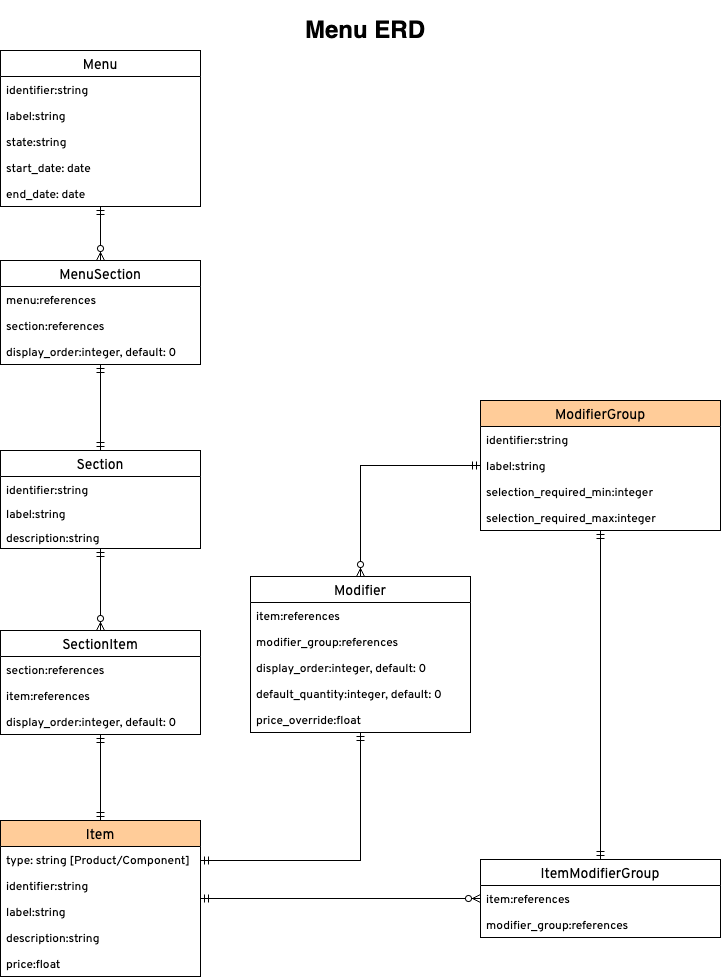

# rails-grain-nat

A technical interview process by Grain to @nielsantosa
A GraphQL Server for Menus


## How to Use
Go to the Web Server. Open in Browser
```
# Open a GraphiQL UI
<host>/graphiql

# or

# curl directly
curl -X POST <host>/graphql -d <query_content>
```


## Schema


### Model Definitions

For this exercise, the terminology used is defined as follows:

- **Menu**: A representation of a restaurant menu.
    - It consists of one or more `Sections` using `MenuSection`.
    - *For example, Pizza Menu*
- **Section**: A collection that contains `Items` through `SectionItem`.
    - *For example, Classic Pizzas*
- **Item**: A complete SKU (Stock Keeping Unit) available for sale. It may have one or multiple `ModifierGroup` through `ItemModifierGroup`.
    - *For example, Margherita Pizza*
    - Can have a type of either `Product`  or `Component`
- **Modifier Group**: An entity encompassing one or more `Modifier` and functions as a section within an `Item`.
    - *For example, Size of Pizza*
    - Minimum Required: The minimum number of `Modifier` that must be selected. A value of 0 indicates that the modifier group is optional.
    - Maximum Required: The maximum number of `Modifier` that can be selected.
- **Modifier**: A choice within a `ModifierGroup`.
    - A modifier here will point to an `Item`  that is a choice/selection.
    - *For example, an `Item`  with a type of `Component`  and a label of “10" Pizza”*
    - Default Quantity: `Modifier` that are included by default will have a predetermined quantity.

### Query
Replace Object with the desired Model
```
# Get Objects
{
    getObjects (pageNum: Integer) {
        field1
        ...
}

# For Models that are a Join Table, you can query based on the referenced Model
# i.e.
{
    getItemModifierGroups (pageNum: Integer, item_id: 1, modifier_group: 2) {
        field1
        ...
}

# Get Object by ID
{
    getObjectByID (id: id) {
        field1
        ...
}

```

### Mutation
Replace Object with the desired Model
```
# Create object
mutation {
    createObject (input: {inputField: inputValue, ...}) {
        field1
        ...
}

# Update object
mutation {
    updateObject (id: id, input: {inputField: inputValue, ...}) {
        field1
        ...
}

# Delete object
mutation {
    deleteObject (id: id) {
        field1
        ...
}
```
